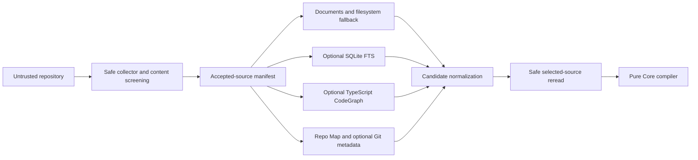
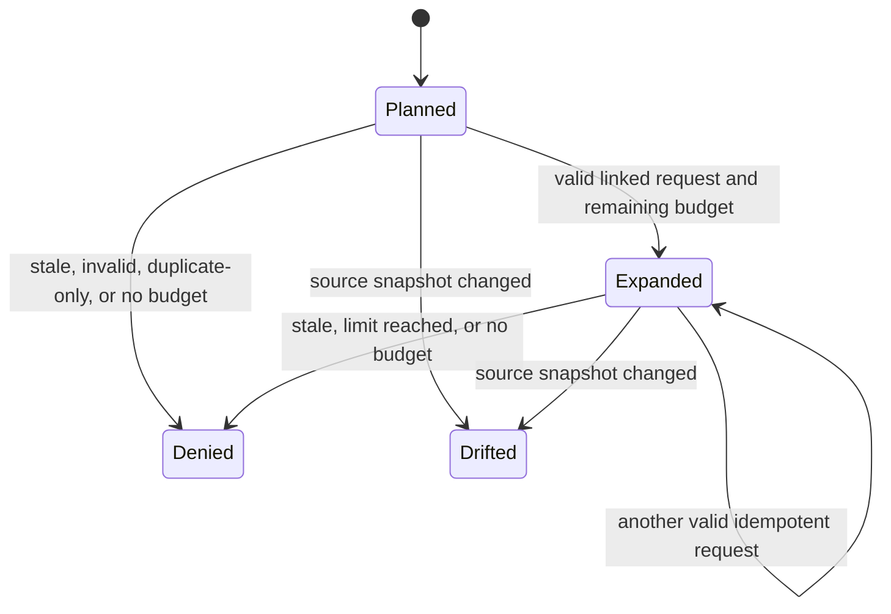

# PrimeContext v0.3 Proof-Carrying Context Compiler Architecture

## 1. Vertical slices

### Compile

```text
CLI validates argv and bounded ContextPlanRequest JSON
  -> safe adapter observes repository/worktree manifest
  -> optional sources capability-detect and return bounded candidates
  -> selected source bytes are safely reread and rehashed
  -> Core compiles candidates under immutable policy and budget
  -> schemas validate ContextEnvelope and SelectionReceipt
  -> CLI durably replaces task-local request/envelope/receipt
  -> one bounded JSON result is emitted
```

### Expand

```text
CLI validates ExpansionRequest and prior local state
  -> re-establish snapshot/index/selected-source freshness
  -> adapters discover only bounded requested evidence
  -> Core applies monotonic budget and duplicate accounting
  -> schemas validate ExpansionDecision and new envelope
  -> CLI appends the decision and replaces the envelope/receipt
```

### Observe and experiment

```text
validated OutcomeReceipt -> append-only local ledger

persisted request + fresh repository -> deterministic replay comparison

persisted envelope - one non-mandatory candidate
  -> pure Core coverage/budget recomputation
  -> experimental ablation result
```

Replay and ablation do not invoke an agent, execute repository code, or infer a
causal effect.

## 2. Dependency direction and package ownership

The existing dependency direction remains:

```text
schemas -> core -> adapters / repo-map / benchmark -> cli
```

### `@primecontext/schemas`

- owns the additive physical v0.3 JSON schemas and runtime validation;
- owns boundary grammar, limits, unknown-field rejection, cross-field totals,
  digest grammar, stable enums, and defensive validation;
- does not discover files, query SQLite, parse TypeScript, or choose context.

### `@primecontext/core`

- owns boundary-neutral v0.3 types and pure ports;
- canonicalizes candidates, derives content identities and duplicates;
- detects conflicts, derives mandatory status, calculates integer score
  components, selects for marginal coverage, accounts budgets, and emits stable
  reason codes;
- owns expansion state transitions, replay comparison, and ablation derivation;
- accepts hashing and canonical-byte operations through ports where needed;
- imports no filesystem, Git, SQLite, TypeScript, CLI, Node-process, or
  vendor-specific implementation.

Core operates on validated values. Adapter output is still revalidated at the
adapter-to-Core boundary.

### `@primecontext/adapters`

- owns safe repository/worktree collection and source rereads;
- adapts the v0.2 Document Catalog/live search and v0.1 Repo Map/Git metadata
  into bounded v0.3 candidates;
- owns the optional local SQLite/FTS implementation and TypeScript CodeGraph;
- binds every result to source hashes and snapshot evidence;
- returns bounded data and structured capability/freshness/truncation outcomes;
- never chooses mandatory status, final scores, evidence status, or selection.

### `@primecontext/repo-map`

Remains structural repository orientation. It does not become a general graph
or selection engine. Existing exports and behavior remain unchanged.

### `@primecontext/benchmark`

Remains experiment comparison. It may consume exported v0.3 evidence in a
later gate, but v0.3 selection policy does not depend on benchmark.

### `@primecontext/cli`

- owns strict command parsing and repository-local file orchestration;
- composes validated services and optional adapters;
- owns safe state containment, bounded JSON/JSONL reads, locking, temporary
  sibling writes, replacement, and sanitized error mapping;
- emits validated domain outputs and does not duplicate Core scoring policy.

No seventh package is introduced in v0.3.

## 3. Core ports

The implementation can use interfaces equivalent to:

```text
ContextSource
  capability(): available | unavailable(reason)
  discover(validated request, snapshot, ceilings): SourceOutcome
  recollect(candidate locator, expected hash, ceilings): FreshCandidate

ContextHasher
  sha256(canonical bytes): sha256:<hex>

ContextStateStore
  readPlan(task id): validated state
  replacePlan(validated plan state): void
  appendExpansion/outcome(validated record): void
  writeExperiment(validated result): void
```

`ContextSource` is a Core-facing data port. Concrete filesystem, document,
Repo Map, Git, FTS, and CodeGraph classes stay in adapters. Persistence is an
application/CLI port rather than Core policy.

Optional-source handling distinguishes the following conditions. A successful
provider contributes bounded candidates; the current receipt does not add a
separate positive status for every provider.

- `TRUNCATED`: safe partial discovery with explicit counters/reason;
- `UNAVAILABLE`: capability missing or timed out; fallback continues;
- `STALE`: stored snapshot differs; source is not used;
- `INVALID`: malformed or tampered source output; source is not used;
- `SECURITY_FAILURE`: global planning aborts.

## 4. Source composition

The mandatory safe collector establishes the canonical accepted-source
manifest. Other sources can identify candidates but cannot expand the readable
corpus or bypass exclusions.



Provider order is stable and specified by the v0.3 contract. Filesystem
enumeration order, database row order, parser-map order, locale, and time do not
affect normalized candidate order or digests.

Reusing an accepted repository observation does not make its paths trusted.
Document collection revalidates every accepted path against the same
filesystem-aware configured-exclude predicate used by safe discovery before
opening content.

## 5. Hybrid index architecture

### Build

1. Validate configuration and state paths before repository reads.
2. Acquire the single-writer context-index lock.
3. Collect the bounded safe corpus and compute its canonical manifest digest.
4. Exclusively create a random sibling SQLite database below the validated
   context-state directory.
5. Create `entries_fts` from one canonical DDL using tokenizer
   `unicode61 remove_diacritics 0`; enable foreign keys, bounded busy timeout,
   `secure_delete=ON`, and FTS5 `secure-delete=1` when supported. Never load an
   extension.
6. Within one transaction, store explicit manifest/source metadata and
   screened source text in FTS. CodeGraph facts remain a separately validated,
   freshness-bound candidate source and are not persisted as FTS rows.
7. Validate schema version, counts, manifest digest, size, FTS query smoke, and
   referential integrity.
8. Commit, close, revalidate the source/destination path components, and
   replace the prior database and manifest.
9. Remove a failed sibling database without exposing its contents.

The build is always full replacement. SQLite WAL mode is not used for the
published database; temporary journals remain within the validated sibling
directory and are removed/closed before replacement. An implementation can use
an in-memory build only if it still enforces the byte ceiling.

### Query

1. Recollect the accepted-source manifest.
2. Open the database read-only and begin one read transaction before the first
   schema, integrity, toolchain, metadata, source-row, content, FTS-equivalence,
   or digest read.
3. Compare the exact canonical `entries_fts` DDL/tokenizer identity
   (`unicode61 remove_diacritics 0`), schema version, policy version, capability
   flags, source count, and manifest digest with the index inside that same
   snapshot.
4. Assemble FTS MATCH only from normalized escaped literal terms and bind all
   other values.
5. Apply deterministic `ORDER BY` fields and a hard `LIMIT`; SQLite rank is
   discovery evidence only and never a Core score.
6. Materialize and validate every bounded hit before committing the read
   transaction. Any failure rolls back best-effort and always closes the
   connection.
7. Safely reread any selected range and compare the source/excerpt hashes.

A stale/corrupt/locked/unsupported index cannot return prompt-facing content.
The direct source fallback remains usable.

## 6. TypeScript CodeGraph architecture

The adapter parses accepted files without executing, importing, resolving a
package manager, or invoking a compiler subprocess. It uses the TypeScript
compiler API to produce explicit facts:

- file imports/exports;
- named declarations and their stable source ranges;
- lexical containment;
- syntactically resolvable direct calls;
- tests associated by path/naming/import evidence.

Each node and edge retains file hash, locator, evidence kind, and parser
diagnostics/truncation. Dynamic dispatch, reflection, runtime module loading,
generated declarations, ambiguous aliases, and unresolved calls remain
unknown. Cycles use visited sets. Traversal stops at graph distance five and
the symbol/edge hard ceilings.

The graph can expand a symbol/path hint into candidate source ranges. If a
stable correctness-preserving range cannot be proven, the adapter returns a
bounded enclosing file excerpt instead of an invented fragment.

A supplied accepted-source binding is not authority to expand the readable
corpus. Before TypeScript capability loading or any bound source read, the
adapter reapplies the same filesystem-aware configured-exclude predicate used
by safe discovery, including exact and ancestor paths. That predicate keeps
raw case-sensitive comparison on POSIX and uses both lower/upper comparison
keys on Windows without normalizing Unicode composition. Remaining sources
still pass the closed extension set, sensitive-content screening, stable read,
and observed-hash freshness gates.

## 7. Canonicalization and receipts

Canonical JSON is constructed with explicit known keys in contract order,
UTF-8 encoding, ordinally sorted set-like arrays, and no insignificant
whitespace. Host `JSON.stringify` of an unconstrained object is not a contract.
Undefined values, non-finite numbers, prototypes, accessors, `toJSON`, unknown
keys, duplicate IDs, and unsafe integer values are rejected before hashing.
String validation follows each public contract plus the aggregate canonical
input ceiling; the smaller prompt-excerpt boundary is not reused to reject a
contract-valid Repo Map package role.

The selection digest covers policy version, task/snapshot identity, effective
budget, selected canonical candidates, coverage, conflicts, and statuses. The
receipt digest covers the request digest, selection digest, every considered
decision, recorded source failures/truncation, and policy components. Generated
timestamps are stored for operations but excluded from deterministic digests.
Before either artifact or digest is built, source failures are validated,
defensively cloned, redacted through the bounded public-error policy,
Unicode-safely capped at 4,096 characters, and ordered by provider, code,
redacted message, and `security_control`. Input, envelope, and receipt failure
objects do not alias one another.

The receipt is proof-carrying in a narrow linked-audit sense: it binds the
selection to candidate/source/excerpt digests and recorded policy decisions. A
verifier still needs the linked request, canonicalization rules, and separately
obtained source bytes or an independently trusted digest. The receipt is not
self-contained proof, cryptographic authentication, semantic truth, or
model-quality evidence.

Duplicate provenance is bidirectional: groups are disjoint and
non-self-referential; every duplicate omission belongs to exactly one group;
the named representative is distinct and included; and no omitted
representative or orphan `duplicate_of` is accepted.

## 8. Budget and selection pipeline

```text
validated request + effective hard caps
  -> normalized candidate set
  -> invalid/stale/unsafe omissions
  -> duplicate groups
  -> authority conflict groups
  -> mandatory required-source/applicable-policy candidates
  -> greedy new-criterion coverage / explicit expansion / conflict review
  -> score and ordinal tie-breaks, never a budget-filling phase
  -> explicit sufficient-evidence stop when no required marginal value remains
  -> recomputed totals and evidence status
  -> canonical envelope + complete receipt
```

Mandatory overflow returns an exhausted, insufficient result and receipt; it
never silently prunes policy. Optional candidate overflow records whether item,
byte, or estimated-token budget was decisive.

Task Capsule allowed/forbidden paths constrain ordinary evidence. They do not
prefilter recognized repository policy before compilation: root/applicable
nested `AGENTS.md` and conditionally applicable `SECURITY.md` remain available
for Core's deterministic policy decision, while unrelated governance material
does not become mandatory by default.

## 9. Progressive expansion state machine



The state carries selected content IDs, cumulative exact bytes/tokens/items,
accepted-request digests, expansion count, original caps, and current selection
digest. The same request digest against the same state returns the previously
validated decision. A request linked to another selection or snapshot is
denied, not rebased implicitly.

Expansion is monotonic over selected IDs. A newly mandatory alias with exact
duplicate content cannot replace or evict a retained item. It is represented as
a separate bounded selected item when the cumulative budget permits; otherwise
the previous package remains intact and the expansion is denied or remains
explicitly insufficient.

## 10. State, consistency, and concurrency

State uses the paths frozen in the specification. Every read is byte/structure
bounded and every record is validated as untrusted. Plan replacement is
all-or-last-valid-state at the application level: request, envelope, and receipt
are assembled into one validated `package.json` and published by an exclusive
sibling write plus same-directory rename only after all validate. Readers never
observe independently replaced envelope/receipt pairs.

One writer per context state directory is supported. Lock acquisition is
exclusive, bounded, owner-metadata-free or sanitized, and stale-lock recovery
must not infer safety solely from a timestamp. Automatic stale-lock reclaim is
not attempted: a positively dead same-host owner still leaves the exact lock
blocking for explicit operator removal, avoiding a check/rename race that could
move a newer writer's lock. Readers validate the published manifest/digests.
Multi-process serializable planning is not promised.

Before any state write, the configured state directory must remain ignored
under effective ordered Git semantics. Evaluation starts at the root
`.gitignore` and continues through every ancestor `.gitignore` below it, with
each ruleset interpreted relative to its containing directory. The bounded
verifier reads at most 64 applicable ignore files and 1 MiB in aggregate;
missing root protection, ceiling exhaustion, malformed or ambiguous rules, and
descendant re-inclusions fail closed. This includes variant-case rules on a
case-insensitive repository. Git control/glob metacharacters in `state_dir` are
encoded as a literal ignore path. Pattern evaluation is a literal, linear scan;
it never compiles repository input to RegExp or performs wildcard backtracking.
Only unambiguous literal positive rules can restore ignored state. Ambiguous
globs, character classes, or escapes cannot do so, and ambiguous negations fail
closed. Full-path/basename candidates and their lowercase forms are precomputed
once per base, with early length rejection retaining the intended
`O(B + D*S)` bound (`B` aggregate ignore bytes, `D <= 64` bases, `S` normalized
state path length). Initialization publishes the root rule and verifies the
complete hierarchy before it creates the state directory or its lock. Default
configuration creation then uses a flushed temporary file inside that ignored
state directory and an atomic hard-link create, never a replace-style rename,
so a concurrent or external winner is not overwritten. Initialization retries
boundedly when the observed configuration changes, reports an explicit
retryable state error when the locked/final observation diverges, and
revalidates both configuration identity and ignore protection after state
directory creation. An exported preparation observation is defensively cloned
and privately bound to
its root,
configuration, accepted body hashes and bytes, locators, documents, graph,
Repo Map, source failures, and omission metadata. Candidate construction rejects
any mutation rather than trusting an outer hash copied from the observation.

Selection consumes one accepted observation. A separate bounded recollection
may verify the complete accepted-source identity immediately before
publication, but verification bytes never enter or alter selection.

JSONL outcomes/expansions validate the full prior file, append no more than the
remaining hard size/count, flush, and use replacement if portable atomic append
cannot preserve a complete last-valid record. Partial trailing JSON is state
corruption, never silently ignored.

## 11. Trust and data flow

| Boundary | Untrusted input | Validation before use | Possible persistence/output |
|---|---|---|---|
| CLI | argv and JSON | grammar, containment, bytes/depth/values, schema | sanitized error or validated result |
| Repository | paths, metadata, bytes, TypeScript syntax | safe walker, stable handle, strict decode, screening, hashes | screened FTS text/excerpts/metadata |
| Optional adapters | SQLite rows and graph facts | capability, schema, limits, snapshot, hashes | compact receipt outcomes/candidates |
| Local state | JSON, JSONL, SQLite | size, version, structure, digest, referential integrity | inspected/replayed validated data |
| Consumer | expansion/outcome declarations | linkage, budget, schema, source | expansion/outcome local state |
| Stdout/stderr | selected content or errors | output limits, controls, disclosure policy | caller-controlled terminal/log |

There is no network boundary in v0.3.

## 12. Threat controls

- Prompt-injection text remains labeled source data and cannot change policy,
  limits, provider order, or command execution.
- Path traversal, aliases, symlinks/junctions, and same-file identity changes
  are rejected around repository and state operations.
- Secret/PII detectors run before indexing and again before selected content is
  emitted; blocked paths are never opened for content.
- Raw FTS syntax, SQL identifiers, extensions, pragmas, or database paths do
  not come from the request.
- Index/request/receipt/outcome tampering is detected by schema, canonical
  digest, source freshness, and cross-record validation.
- SQLite validation and final MATCH/materialization share one read transaction,
  preventing a concurrent writer from substituting rows between validation and
  use; exact canonical FTS DDL/tokenizer identity is checked in that snapshot.
- Accepted document observations and bound CodeGraph paths reapply the shared
  filesystem-aware configured-exclude predicate before optional runtime loading
  or reads; CodeGraph also retains extension, sensitive-content, and freshness
  validation.
- State-ignore validation applies root and ancestor `.gitignore` precedence
  relative to each containing directory, with 64-file and 1-MiB ceilings and
  fail-closed handling for re-inclusion or ambiguous evaluation. Its literal
  linear matcher does not construct a RegExp, and only an unambiguous positive
  literal can restore protection.
- Initialization establishes ignore protection before state, publishes a
  flushed default config by create-only hard link from ignored state, preserves
  an external/concurrent winner, and revalidates final configuration and ignore
  state. A genuine publication `EPERM` without a winner remains an error.
- Authorization Basic/Bearer values are redacted as complete credential fields
  before public error serialization. Opaque-token screening uses simple
  candidate extraction plus one linear letter/digit classification pass rather
  than the prior quadratic-lookahead form. The same bounded redactor runs on
  compiler source failures before envelope/receipt construction and hashing.
- Applicable policy derives from both explicit target paths and physical
  candidate paths made relevant by query/criterion evidence; security
  applicability uses the same bounded lexical rules in Core and the CLI, reads
  the complete request vocabulary independently of ranking caps, and remains a
  conservative heuristic rather than a semantic classifier. Capsule evidence
  boundaries cannot prefilter recognized policy before this Core decision.
- Replay attacks fail selection/snapshot/request linkage; duplicate expansions
  are idempotent.
- Candidate/index/AST/JSON/output ceilings and cooperative deadline checkpoints
  constrain resource exhaustion; they are not an OS CPU/time quota. Unsupported
  optional sources fail open, while safety-control failure aborts.
- Errors and source-failure artifacts omit source content, matched secret
  values, SQL, native stacks, and terminal controls.

Residual same-user TOCTOU, unencrypted local-state disclosure, SSD/backup
remanence, parser incompleteness, lexical false positives/negatives, duplicated
Core/CLI security-classifier rules, cooperative cancellation, and single-writer
limitations remain explicit.

## 13. Failure recovery

| Failure point | Recovery behavior |
|---|---|
| validation or safe collection | no state write; prior state remains |
| optional FTS/CodeGraph unavailable | receipt records source failure; fallback continues |
| global screening/containment failure | fail closed; no partial envelope |
| temporary index/plan write | remove contained temporary state; prior state remains |
| flush/close/validation before rename | prior published state remains |
| rename | report state/I/O error; do not claim publication |
| default-config publication race | preserve the winner; report/retry on changed configuration; never replace it |
| post-rename path race | report residual failure; old bytes may no longer be recoverable |
| stale plan/index/replay source | deny use and require recollection/rebuild |
| corrupt JSONL | reject complete ledger; never skip records silently |

Portable Node APIs do not provide a universal directory `fsync`, no-follow
transaction, or power-loss guarantee. The implementation and verification must
state exactly which durability behavior was observed.

## 14. Verification order

1. physical-schema generation and runtime-validator fixtures;
2. pure Core determinism, conflict, mandatory, coverage, budget, expansion,
   replay, and ablation tests;
3. safe collector, FTS replacement/query/removal, and CodeGraph fixtures;
4. state fault injection, tamper, lock, freshness, and disclosure tests;
5. CLI strict-argv and disposable vertical smoke;
6. complete v0.1/v0.2 compatibility suite;
7. supported Node matrix, package dry runs, dependency/license scan, docs links,
   diff check, typecheck, full tests, and build;
8. independent security and correctness review tied to an immutable tree.

Verification proves implementation conformance, not superior performance.

## 15. Working-tree scan provenance

Third working-tree scan `b23f2fc5-f4a9-42cc-bba9-cdacd080b1c9` reviewed 54/54
assigned files against baseline `80bf4f08` and frozen snapshot
`codex-security-snapshot/v1:sha256:69c4fac06bfe7ad4e59044f0db58f0425f2d7372ed25f5735353eb2d7ed3f0a3`.
Its coverage receipt is
`sha256:5389f1aaee8da005418581c7a8d20cc11edfff93d88f10aad62a87541ed98a66`;
its zero-finding artifact is
`sha256:dd09db6d382c191aae181f945efbc917e92df19e89d1b8f58be2321b9c9ccd58`.
Strict diff sealed zero reportable findings and suppressed one inherited
candidate concerning descendant `.gitignore` precedence.

The hierarchical verifier described in section 10 was implemented with
targeted RED→GREEN coverage after that snapshot and then hardened to its final
literal/linear form. REDs covered Git-positive lookalikes `foo**bar/baz/`,
`foo***bar/baz/`, and `foo[/]bar/baz/`, an adversarial wildcard under a
2-second subprocess timeout, and a 30,000-character state path with 30,000
literal rules under a 2.5-second timeout. All are GREEN. The recorded final root
`npm test` run contained 387 tests: 382 passed, 5 skipped, and 0 failed.
Consequently, the third scan is pre-fix evidence rather than a scan of the
corrected tree.

Fourth working-tree scan `5727be72-aac0-4f99-917c-ff5a20d17e97` compared the
same baseline with frozen snapshot
`codex-security-snapshot/v1:sha256:76db2ea81950b5c1ad79b48c58ad7ab48a3c84aafa747ab53ab4c7130b651ebf`.
Its coverage artifact is sealed by
`sha256:51385f3eac6f244b6309d6ef71adf91abcf5f288e5f491939e3718e0cc771d43`,
and its findings artifact by
`sha256:221816704c59a2f414812f4adeec0f8be15feaed2d63b4d3635e596f47606067`.
It sealed one medium finding, `csf_c7a625bef52f5364ba317c81`, in the reachable
public error path: opaque-secret lookaheads could repeatedly rescan a long
candidate and produce quadratic work. The recorded public RED took 2,337 ms.

After that snapshot, [Core error redaction](../../packages/core/src/errors.ts)
was changed to simple token-candidate extraction and a single letter/digit scan.
The public GREEN path completed in approximately 2 ms, and a direct
65,537-character scale check completed in 0.779 ms in the recorded local run.
The reachable regression in [Core tests](../../packages/core/src/core.test.ts)
requires completion below one second. The subsequent root `npm test` run
contained 388 tests: 383 passed, 5 skipped, and 0 failed. These measurements are
point-in-time anti-regression evidence rather than a general performance claim.

The fourth scan is explicitly pre-fix because this remediation changed its
frozen tree.

Fifth working-tree scan `4577d98f-9433-43c7-816c-f00dd1ecd5a5` compared the
same baseline with frozen snapshot
`codex-security-snapshot/v1:sha256:ab602788d6933773a7111fd36bb46ea12c3d611a6a54492f667ce6595b8cb48c`.
Its coverage artifact is sealed by
`sha256:bbd087bea53085826e923783c7e8926c7df0c3be42ddbf25477ce43c4215cfbd`,
and its findings artifact by
`sha256:13cc6d32adea7457a0eb717df339687f15d99bb5ccff6cd17bcd390b77a7a0c6`.
It completed 54/54 receipts and sealed three low findings in policy
applicability across source, provider, and exact-directory boundaries.

The post-scan design treats omitted recognized policy paths as hidden,
freshness-bound observation state. Source-count, byte, provider, document, and
aggregate caps must either retain an applicable policy or emit a
security-control failure before Core can declare `READY`. Target scopes are
precomputed once with a 64-segment bound, so applicability is
`O(P + T*64)` rather than a policy-by-target product. Core tests the exact
directory scope before ancestors, does not reinterpret a known extensionless
file as a directory, and resolves case variants deterministically while
preserving the selected repository path.

After those corrections, a separate concurrency review reproduced a Windows
Node 24 RED in zero-config initialization: concurrent replace-style config
publication could make one rename fail with `EPERM`. The frozen design now
publishes/verifies ignore protection first, prepares and flushes the default
config inside ignored state, uses an atomic hard-link create with no clobber,
preserves an external winner with retry semantics, and revalidates final
configuration plus ignore protection. Focused Node 22.13.1/24.19.0/25.9.0
cases and independent targeted rereview recorded `PASS`.

The resulting frozen-tree suites recorded: integrated Node 25.9 `npm run
verify`, 408 total / 403 pass / 5 skip / 0 fail in 67.377527 s; Node 22.13.1,
408 total / 386 pass / 22 skip / 0 fail in 106.206661 s; Node 24.19.0,
408 total / 403 pass / 5 skip / 0 fail in 104.531991 s; and standalone Node
25.9 `npm test`, 408 total / 403 pass / 5 skip / 0 fail in 108.524598 s.

The fifth scan is pre-fix because the policy corrections and later init-race
correction changed its frozen tree.

Sixth working-tree scan `a8688bba-4c56-458d-a8c7-7bbcdc824590` was sealed at
`2026-08-20T20:39:49.161722Z` against baseline `80bf4f08` and frozen snapshot
`codex-security-snapshot/v1:sha256:f91d5f37160a8901172d549a1cf4d99b5fa7f578bd4dc2023c958c2692960968`.
Its findings and coverage artifacts are sealed by
`sha256:0390aaa4a4d854a5ebad30606626c39b5d21592a8a504203b1deec1a0b353417`
and
`sha256:a6aa83fc8a2257bf29618e62fafc1d86802ccb5e80af4436135f86643466ce11`.
It reported medium `csf_ba4307bd4c60cb716d6c3b25` at the public
source-failure artifact boundary and low `csf_b78ca1b9b13abea1d5ce6829` plus
`csf_1a42f17878147be34a0bf639` at the Windows configured-exclude alias
boundary for CodeGraph and accepted documents.

The source-failure canonicalization and shared filesystem-aware exclude design
described above were implemented through RED→GREEN changes after that snapshot.
The sixth scan is therefore complete but pre-fix.

Seventh working-tree scan `8672e283-008c-435d-8a16-fc98eef31e74` compared the
same baseline with frozen snapshot
`codex-security-snapshot/v1:sha256:926e537221ce9a3a752408f969d3f004321dd0f6534b562444a4b783a5bb7626`.
Its findings/coverage artifacts are sealed by
`sha256:cee727d6e95fab16d357944b1e3b7792048365882d6ad14763ae2f7e7e38e9a0`
and
`sha256:a1e84d13002125cb8084c3c0ada87a13b83fdaf3ecb7cc414ff900e289f9abf4`.
It completed 54/54 reviews and reported one medium imported-envelope failure
redaction gap plus three low NTFS DOS 8.3 physical-path bypasses in Documents,
CodeGraph, and SQLite state.

The post-scan Core design sanitizes and defensively rehashes imported failures
before ablation, replay, or any early-return expansion package. The adapter
design now inserts a Windows-only physical-path binding between lexical
validation and I/O: each existing component is resolved to its long path,
checked for containment and links, and re-evaluated against sensitive and
configured exclusions before TypeScript loading/document reads. SQLite resolves
the existing physical state/index ancestry and validates any still-missing
suffix before loading the runtime or creating directories, locks, temporary
files, or the database. The normal POSIX lexical/no-link model remains
unchanged.

Because those changes followed the frozen snapshot, the seventh scan is also
pre-fix. An eighth/final post-fix scan and the separate immutable-commit review
remain pending.
