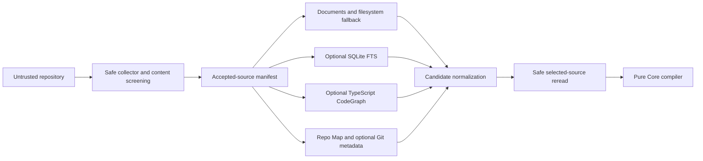
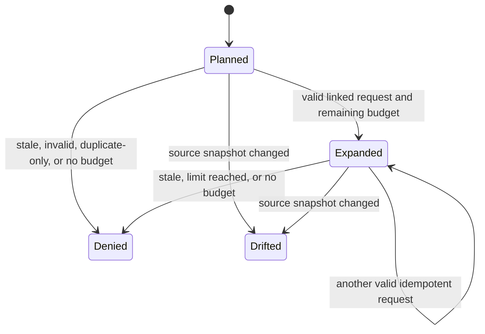

# PrimeContext v0.3 Proof-Carrying Context Compiler Architecture

## 1. Vertical slices

### Compile

```text
CLI validates argv and bounded ContextPlanRequest JSON
  -> safe adapter observes repository/worktree manifest
  -> optional sources capability-detect and return bounded candidates
  -> selected source bytes are safely reread and rehashed
  -> Core compiles candidates under immutable policy and budget
  -> schemas validate ContextEnvelope and SelectionReceipt
  -> CLI durably replaces task-local request/envelope/receipt
  -> one bounded JSON result is emitted
```

### Expand

```text
CLI validates ExpansionRequest and prior local state
  -> re-establish snapshot/index/selected-source freshness
  -> adapters discover only bounded requested evidence
  -> Core applies monotonic budget and duplicate accounting
  -> schemas validate ExpansionDecision and new envelope
  -> CLI appends the decision and replaces the envelope/receipt
```

### Observe and experiment

```text
validated OutcomeReceipt -> append-only local ledger

persisted request + fresh repository -> deterministic replay comparison

persisted envelope - one non-mandatory candidate
  -> pure Core coverage/budget recomputation
  -> experimental ablation result
```

Replay and ablation do not invoke an agent, execute repository code, or infer a
causal effect.

## 2. Dependency direction and package ownership

The existing dependency direction remains:

```text
schemas -> core -> adapters / repo-map / benchmark -> cli
```

### `@primecontext/schemas`

- owns the additive physical v0.3 JSON schemas and runtime validation;
- owns boundary grammar, limits, unknown-field rejection, cross-field totals,
  digest grammar, stable enums, and defensive validation;
- does not discover files, query SQLite, parse TypeScript, or choose context.

### `@primecontext/core`

- owns boundary-neutral v0.3 types and pure ports;
- canonicalizes candidates, derives content identities and duplicates;
- detects conflicts, derives mandatory status, calculates integer score
  components, selects for marginal coverage, accounts budgets, and emits stable
  reason codes;
- owns expansion state transitions, replay comparison, and ablation derivation;
- accepts hashing and canonical-byte operations through ports where needed;
- imports no filesystem, Git, SQLite, TypeScript, CLI, Node-process, or
  vendor-specific implementation.

Core operates on validated values. Adapter output is still revalidated at the
adapter-to-Core boundary.

### `@primecontext/adapters`

- owns safe repository/worktree collection and source rereads;
- adapts the v0.2 Document Catalog/live search and v0.1 Repo Map/Git metadata
  into bounded v0.3 candidates;
- owns the optional local SQLite/FTS implementation and TypeScript CodeGraph;
- binds every result to source hashes and snapshot evidence;
- returns bounded data and structured capability/freshness/truncation outcomes;
- never chooses mandatory status, final scores, evidence status, or selection.

### `@primecontext/repo-map`

Remains structural repository orientation. It does not become a general graph
or selection engine. Existing exports and behavior remain unchanged.

### `@primecontext/benchmark`

Remains experiment comparison. It may consume exported v0.3 evidence in a
later gate, but v0.3 selection policy does not depend on benchmark.

### `@primecontext/cli`

- owns strict command parsing and repository-local file orchestration;
- composes validated services and optional adapters;
- owns safe state containment, bounded JSON/JSONL reads, locking, temporary
  sibling writes, replacement, and sanitized error mapping;
- emits validated domain outputs and does not duplicate Core scoring policy.

No seventh package is introduced in v0.3.

## 3. Core ports

The implementation can use interfaces equivalent to:

```text
ContextSource
  capability(): available | unavailable(reason)
  discover(validated request, snapshot, ceilings): SourceOutcome
  recollect(candidate locator, expected hash, ceilings): FreshCandidate

ContextHasher
  sha256(canonical bytes): sha256:<hex>

ContextStateStore
  readPlan(task id): validated state
  replacePlan(validated plan state): void
  appendExpansion/outcome(validated record): void
  writeExperiment(validated result): void
```

`ContextSource` is a Core-facing data port. Concrete filesystem, document,
Repo Map, Git, FTS, and CodeGraph classes stay in adapters. Persistence is an
application/CLI port rather than Core policy.

Optional-source outcomes distinguish:

- `OK`: complete within source ceilings;
- `TRUNCATED`: safe partial discovery with explicit counters/reason;
- `UNAVAILABLE`: capability missing or timed out; fallback continues;
- `STALE`: stored snapshot differs; source is not used;
- `INVALID`: malformed or tampered source output; source is not used;
- `SECURITY_FAILURE`: global planning aborts.

## 4. Source composition

The mandatory safe collector establishes the canonical accepted-source
manifest. Other sources can identify candidates but cannot expand the readable
corpus or bypass exclusions.



Provider order is stable and specified by the v0.3 contract. Filesystem
enumeration order, database row order, parser-map order, locale, and time do not
affect normalized candidate order or digests.

## 5. Hybrid index architecture

### Build

1. Validate configuration and state paths before repository reads.
2. Acquire the single-writer context-index lock.
3. Collect the bounded safe corpus and compute its canonical manifest digest.
4. Exclusively create a random sibling SQLite database below the validated
   context-state directory.
5. Enable foreign keys, bounded busy timeout, `secure_delete=ON`, and FTS5
   `secure-delete=1` when supported. Never load an extension.
6. Within one transaction, store explicit manifest/source metadata, screened
   source text in FTS, and bounded CodeGraph facts when available.
7. Validate schema version, counts, manifest digest, size, FTS query smoke, and
   referential integrity.
8. Commit, close, revalidate the source/destination path components, and
   replace the prior database and manifest.
9. Remove a failed sibling database without exposing its contents.

The build is always full replacement. SQLite WAL mode is not used for the
published database; temporary journals remain within the validated sibling
directory and are removed/closed before replacement. An implementation can use
an in-memory build only if it still enforces the byte ceiling.

### Query

1. Recollect the accepted-source manifest.
2. Compare schema, policy version, capability flags, source count, and manifest
   digest with the index.
3. Assemble FTS MATCH only from normalized escaped literal terms and bind all
   other values.
4. Apply deterministic `ORDER BY` fields and a hard `LIMIT`; SQLite rank is
   discovery evidence only and never a Core score.
5. Map rows to bounded candidates and validate every field.
6. Safely reread any selected range and compare the source/excerpt hashes.

A stale/corrupt/locked/unsupported index cannot return prompt-facing content.
The direct source fallback remains usable.

## 6. TypeScript CodeGraph architecture

The adapter parses accepted files without executing, importing, resolving a
package manager, or invoking a compiler subprocess. It uses the TypeScript
compiler API to produce explicit facts:

- file imports/exports;
- named declarations and their stable source ranges;
- lexical containment;
- syntactically resolvable direct calls;
- tests associated by path/naming/import evidence.

Each node and edge retains file hash, locator, evidence kind, and parser
diagnostics/truncation. Dynamic dispatch, reflection, runtime module loading,
generated declarations, ambiguous aliases, and unresolved calls remain
unknown. Cycles use visited sets. Traversal stops at graph distance five and
the symbol/edge hard ceilings.

The graph can expand a symbol/path hint into candidate source ranges. If a
stable correctness-preserving range cannot be proven, the adapter returns a
bounded enclosing file excerpt instead of an invented fragment.

## 7. Canonicalization and receipts

Canonical JSON is constructed with explicit known keys in contract order,
UTF-8 encoding, ordinally sorted set-like arrays, and no insignificant
whitespace. Host `JSON.stringify` of an unconstrained object is not a contract.
Undefined values, non-finite numbers, prototypes, accessors, `toJSON`, unknown
keys, duplicate IDs, and unsafe integer values are rejected before hashing.

The selection digest covers policy version, task/snapshot identity, effective
budget, selected canonical candidates, coverage, conflicts, and statuses. The
receipt digest covers the request digest, selection digest, every considered
decision, source outcomes, and policy components. Generated timestamps are
stored for operations but excluded from deterministic digests.

The receipt is proof-carrying in the narrow reproducibility sense: it lets a
consumer verify which exact bytes and policy decisions produced a selection.
It is not cryptographic authentication, semantic truth, or model-quality proof.

## 8. Budget and selection pipeline

```text
validated request + effective hard caps
  -> normalized candidate set
  -> invalid/stale/unsafe omissions
  -> duplicate groups
  -> authority conflict groups
  -> mandatory required-source/applicable-policy candidates
  -> greedy new-criterion coverage
  -> score fill
  -> recomputed totals and evidence status
  -> canonical envelope + complete receipt
```

Mandatory overflow returns an exhausted, insufficient result and receipt; it
never silently prunes policy. Optional candidate overflow records whether item,
byte, or estimated-token budget was decisive.

## 9. Progressive expansion state machine



The state carries selected content IDs, cumulative exact bytes/tokens/items,
accepted-request digests, expansion count, original caps, and current selection
digest. The same request digest against the same state returns the previously
validated decision. A request linked to another selection or snapshot is
denied, not rebased implicitly.

## 10. State, consistency, and concurrency

State uses the paths frozen in the specification. Every read is byte/structure
bounded and every record is validated as untrusted. Plan replacement is
all-or-last-valid-state at the application level: request, envelope, and receipt
are assembled into one validated `package.json` and published by an exclusive
sibling write plus same-directory rename only after all validate. Readers never
observe independently replaced envelope/receipt pairs.

One writer per context state directory is supported. Lock acquisition is
exclusive, bounded, owner-metadata-free or sanitized, and stale-lock recovery
must not infer safety solely from a timestamp. Readers validate the published
manifest/digests. Multi-process serializable planning is not promised.

JSONL outcomes/expansions validate the full prior file, append no more than the
remaining hard size/count, flush, and use replacement if portable atomic append
cannot preserve a complete last-valid record. Partial trailing JSON is state
corruption, never silently ignored.

## 11. Trust and data flow

| Boundary | Untrusted input | Validation before use | Possible persistence/output |
|---|---|---|---|
| CLI | argv and JSON | grammar, containment, bytes/depth/values, schema | sanitized error or validated result |
| Repository | paths, metadata, bytes, TypeScript syntax | safe walker, stable handle, strict decode, screening, hashes | screened FTS text/excerpts/metadata |
| Optional adapters | SQLite rows and graph facts | capability, schema, limits, snapshot, hashes | compact receipt outcomes/candidates |
| Local state | JSON, JSONL, SQLite | size, version, structure, digest, referential integrity | inspected/replayed validated data |
| Consumer | expansion/outcome declarations | linkage, budget, schema, source | expansion/outcome local state |
| Stdout/stderr | selected content or errors | output limits, controls, disclosure policy | caller-controlled terminal/log |

There is no network boundary in v0.3.

## 12. Threat controls

- Prompt-injection text remains labeled source data and cannot change policy,
  limits, provider order, or command execution.
- Path traversal, aliases, symlinks/junctions, and same-file identity changes
  are rejected around repository and state operations.
- Secret/PII detectors run before indexing and again before selected content is
  emitted; blocked paths are never opened for content.
- Raw FTS syntax, SQL identifiers, extensions, pragmas, or database paths do
  not come from the request.
- Index/request/receipt/outcome tampering is detected by schema, canonical
  digest, source freshness, and cross-record validation.
- Replay attacks fail selection/snapshot/request linkage; duplicate expansions
  are idempotent.
- Candidate/index/AST/JSON/output/time ceilings contain resource exhaustion;
  unsupported optional sources fail open, while safety-control failure aborts.
- Errors omit source content, matched secret values, SQL, native stacks, and
  terminal controls.

Residual same-user TOCTOU, unencrypted local-state disclosure, SSD/backup
remanence, parser incompleteness, lexical false positives/negatives, and
single-writer limitations remain explicit.

## 13. Failure recovery

| Failure point | Recovery behavior |
|---|---|
| validation or safe collection | no state write; prior state remains |
| optional FTS/CodeGraph unavailable | receipt records source failure; fallback continues |
| global screening/containment failure | fail closed; no partial envelope |
| temporary index/plan write | remove contained temporary state; prior state remains |
| flush/close/validation before rename | prior published state remains |
| rename | report state/I/O error; do not claim publication |
| post-rename path race | report residual failure; old bytes may no longer be recoverable |
| stale plan/index/replay source | deny use and require recollection/rebuild |
| corrupt JSONL | reject complete ledger; never skip records silently |

Portable Node APIs do not provide a universal directory `fsync`, no-follow
transaction, or power-loss guarantee. The implementation and verification must
state exactly which durability behavior was observed.

## 14. Verification order

1. physical-schema generation and runtime-validator fixtures;
2. pure Core determinism, conflict, mandatory, coverage, budget, expansion,
   replay, and ablation tests;
3. safe collector, FTS replacement/query/removal, and CodeGraph fixtures;
4. state fault injection, tamper, lock, freshness, and disclosure tests;
5. CLI strict-argv and disposable vertical smoke;
6. complete v0.1/v0.2 compatibility suite;
7. supported Node matrix, package dry runs, dependency/license scan, docs links,
   diff check, typecheck, full tests, and build;
8. independent security and correctness review tied to an immutable tree.

Verification proves implementation conformance, not superior performance.
